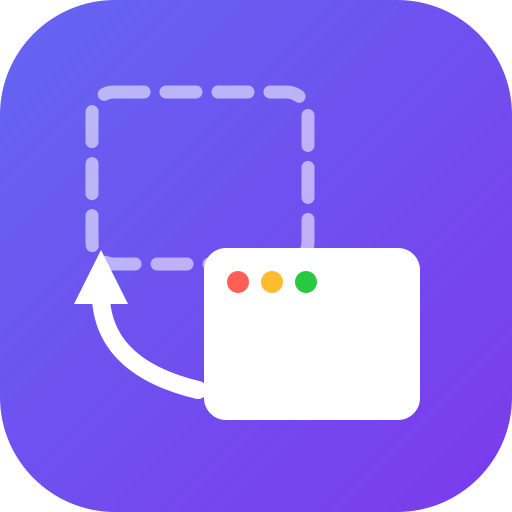
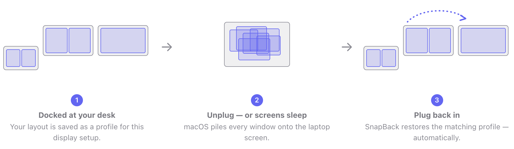
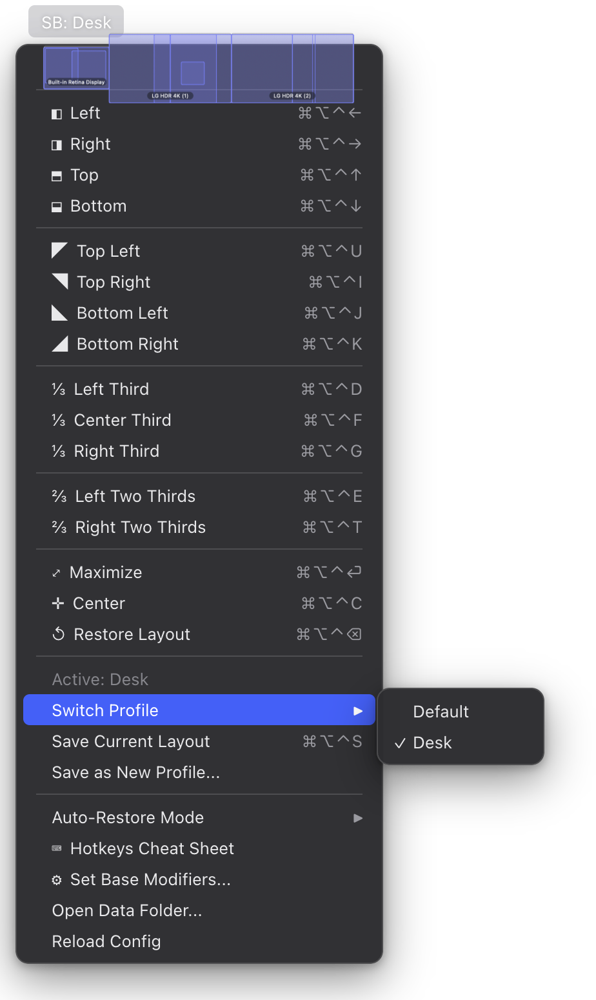

<p align="center">
  
</p>

<h1 align="center">SnapBack</h1>

<p align="center"><strong>Your windows, back where they belong.</strong></p>

<p align="center">
  <a href="https://github.com/jamesagarside/snapback/releases"></a>
  
  <a href="LICENSE"></a>
  
</p>

You unplug your MacBook from your monitors and every window piles onto the laptop screen. You plug back in — or your displays simply wake from sleep — and macOS has shuffled everything. SnapBack fixes that: it remembers a window layout for **every display setup** you use (desk, office, laptop-only) and puts everything back automatically when your screens change.

<p align="center">
  
</p>

Built on [Hammerspoon](https://www.hammerspoon.org/). Free and open source.

## Why SnapBack

* **Layout profiles per display setup**: Each monitor configuration gets its own saved layouts. Multiple named profiles per setup (e.g. "Coding", "Meeting").
* **Auto-restore on dock, undock, and wake**: When your display configuration changes, SnapBack restores the matching layout — automatically, after a prompt, or never (your choice, in the menubar).
* **Smart window matching**: Finds your windows even when titles change (Chrome tabs, editors), falling back from exact ID → title → fuzzy → same-app matching.
* **Snapping included**: Halves, thirds, two-thirds, quarters, center, maximize — with hotkeys and a menubar menu. Press Left/Right twice to throw a window to the previous/next screen. Zero animation delay.
* **Automation-friendly**: Trigger everything from a Stream Deck, Shortcuts, or scripts via `hammerspoon://` URLs.
* **Spaces support (best-effort)**: Attempts to remember which Space a window belongs to. macOS APIs for Spaces are private and can be unreliable on recent macOS versions.

Everything lives in the menubar. The map at the top of the menu is your actual display arrangement, drawn to scale, with the active profile's saved windows in place — so you can see what will snap back before it does:

<p align="center">
  
</p>

## Installation

### One-line install

```sh
curl -fsSL https://raw.githubusercontent.com/jamesagarside/snapback/main/scripts/install.sh | bash
```

This installs Hammerspoon (via Homebrew) if you don't have it, installs SnapBack, and wires it into your Hammerspoon config. It's idempotent — re-run it any time to upgrade. On first install, grant Hammerspoon Accessibility permission when macOS prompts (System Settings → Privacy & Security → Accessibility).

### Manual install

1. Install [Hammerspoon](https://www.hammerspoon.org/) and grant it Accessibility permission (System Settings → Privacy & Security → Accessibility).
2. Download **SnapBack.spoon.zip** from the [latest release](https://github.com/jamesagarside/snapback/releases) and unzip it.
3. Double-click `SnapBack.spoon` (Hammerspoon installs it), or move it to `~/.hammerspoon/Spoons/` manually.
4. Add this to your `~/.hammerspoon/init.lua`:

```lua
hs.loadSpoon("SnapBack")
spoon.SnapBack:start()
```

5. Reload Hammerspoon.

## Quick start (the travel workflow)

1. At your desk with everything plugged in, arrange your windows how you like them.
2. Press `⌃⌥⌘ S` (or menubar **SB** → *Save Current Layout*).
3. That's it. Unplug, work from the sofa, plug back in — SnapBack notices the displays returned and puts every window back. Do the same once for your laptop-only layout and it restores that when you undock, too.

Auto-restore behaviour is configurable under **SB → Auto-Restore Mode**: *Automatic*, *Prompt* (ask first), or *Disabled* (restore manually with `⌃⌥⌘ ⌫`).

## Hotkeys

Default base modifiers: **⌃⌥⌘** (Ctrl + Alt + Cmd) — customizable via **SB → Set Base Modifiers...**.

| Action | Key | Description |
| :--- | :--- | :--- |
| **Save Layout** | `S` | Save current window positions to the active profile |
| **Restore Layout** | `R` or `⌫` | Restore the active profile |
| **Left / Right Half** | `←` / `→` | Snap to half; keep pressing to walk across screens half-by-half |
| **Top / Bottom Half** | `↑` / `↓` | Snap to top/bottom half (matches the menu; use macOS `⌘M` to minimize) |
| **Corners** | `U` `I` `J` `K` | Top-left / top-right / bottom-left / bottom-right quarter |
| **Thirds** | `D` `F` `G` | Left / center / right third |
| **Two-Thirds** | `E` `T` | Left / right two-thirds |
| **Center** | `C` | Center window at 70% size |
| **Maximize** | `⏎` | Full screen frame |

## Automation / Stream Deck

| Action | URL |
| :--- | :--- |
| Restore active profile | `hammerspoon://snapback?action=restore` |
| Switch to profile and restore | `hammerspoon://snapback?action=restore&profile=Name` |
| Save active profile | `hammerspoon://snapback?action=save` |
| Save to a named profile | `hammerspoon://snapback?action=save&profile=Name` |
| List profiles | `hammerspoon://snapback?action=list` |

(The legacy `hammerspoon://windowlayout` scheme still works.)

## Data & privacy

Layouts and settings are stored as plain JSON in `~/.hammerspoon/snapback/` (menubar → *Open Data Folder...*). Nothing leaves your machine.

## Supported platforms

| Platform | Status |
| :--- | :--- |
| macOS 14 Sonoma | Developed and tested |
| macOS 13 Ventura / macOS 15 Sequoia | Expected to work (anything recent Hammerspoon supports) — not regularly tested, reports welcome |

Requires [Hammerspoon](https://www.hammerspoon.org/) (free) and Accessibility permission — that's how any macOS window manager moves windows.

## Known limitations

* **Spaces**: Moving windows between Spaces relies on private macOS APIs and may fail silently on some macOS versions; windows on non-visible Spaces may not be capturable.
* **Display identity**: Profiles are currently keyed by display IDs that can occasionally change across reboots; migration to stable UUIDs is planned.

## Alternatives

Looking for a free, open-source alternative to Magnet? For snapping alone, [Rectangle](https://rectangleapp.com/) is excellent and simpler to install. SnapBack is for people whose window arrangement gets destroyed by docking, undocking, or display sleep and who want it to come back on its own — plus Stream Deck/URL automation, per-display-setup layout profiles, and the hackability of Hammerspoon underneath.

## Changelog

Release history lives in [CHANGELOG.md](CHANGELOG.md). Every release must have an entry — the release workflow refuses to tag a version whose changelog entry or `obj.version` is missing, so the docs can't fall behind the releases.

## License

Apache-2.0 — see [LICENSE](LICENSE).
